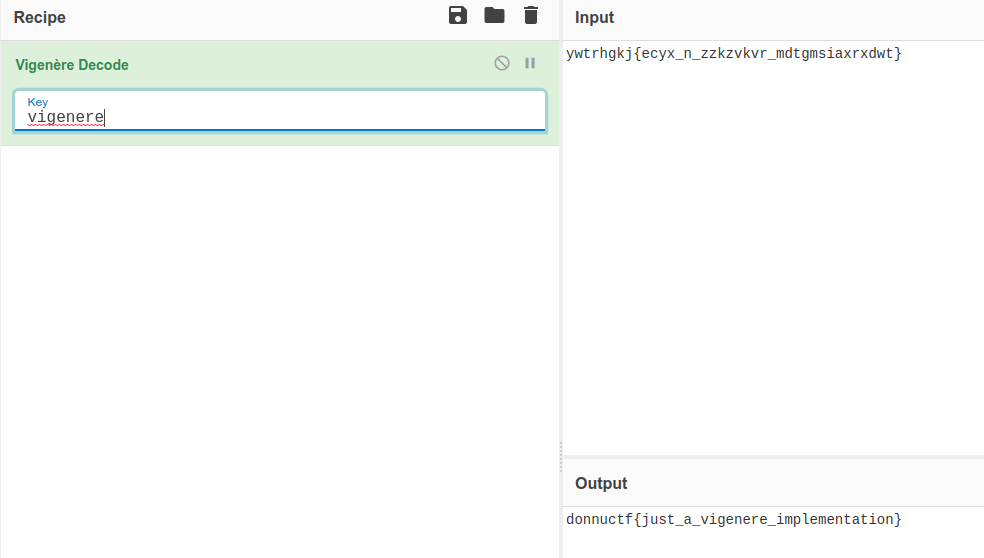

# 12

## Task

```Python
from string import ascii_lowercase


class Cipher:

    def __init__(self, key):
        self.key_length = len(key)
        self.enc_key = []
        self.dec_key = []

        for i in range(self.key_length):
            self.enc_key.append({})
            k = ascii_lowercase.find(key[i])
            for j in ascii_lowercase:
                self.enc_key[i][j] = ascii_lowercase[(ascii_lowercase.find(j) + k) % len(ascii_lowercase)]

        for i in range(self.key_length):
            self.dec_key.append({})
            for j in self.enc_key[i].keys():
                self.dec_key[i][self.enc_key[i][j]] = j

    def encrypt(self, text):
        result = ""
        j = 0
        for i in range(len(text)):
            if text[i] in ascii_lowercase:
                result += self.enc_key[j % self.key_length][text[i]] 
                j += 1
            else:
                result += text[i]
        return result

    def decrypt(self, text):
        result = ""
        j = 0
        for i in range(len(text)):
            if text[i] in ascii_lowercase:
                result += self.dec_key[j % self.key_length][text[i]]
                j += 1
            else:
                result += text[i]
        return result
 

if __name__ == "__main__":
    key = input("Enter key >> ").lower()
    cipher = Cipher(key)

    text = input("Enter text to encrypt >> ").lower()
    encrypted = cipher.encrypt(text)
    print("Encrypted >> " + encrypted)  # ywtrhgkj{ecyx_n_zzkzvkvr_mdtgmsiaxrxdwt}

    decrypted = cipher.decrypt(encrypted)
    print("Decrypted >> " + decrypted)
```

## Solution

Before going through the source code we could just try decrypt ciphertext with some well known ciphers as it really looks like ROT or Vigenere. But as the key is a string, it is probably not ROT. So lets check Vigenere.



Yep, it is a Vigenere. So we didn't even have to look at the source code ;)