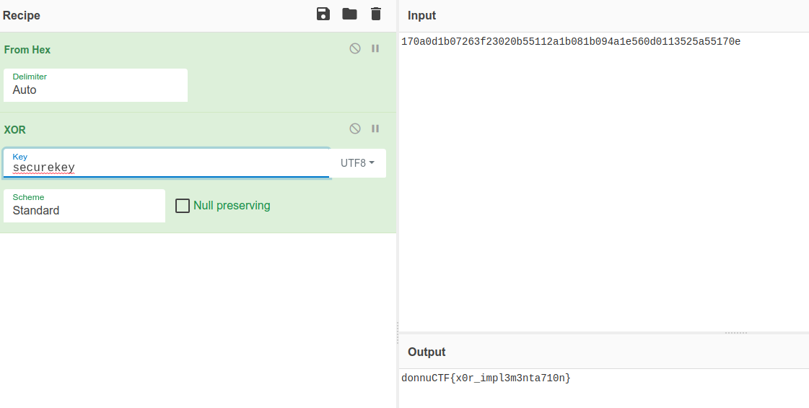

# 8

## Task

```C
#include <stdio.h>
#include <string.h>


char s [] = {23, 10, 13, 27, 7, 38, 63, 35, 2, 11, 85, 17, 42, 27, 8, 27, 9, 74, 30, 86, 13, 1, 19, 82, 90, 85, 23, 14, 0};

int t(int a, int b) {
    return (~a | ~b) & (a | b);
}

void process(char* k) {
    int a = strlen(s);
    int b = strlen(k);

    for (int i = 0; i < a; i++) {
        s[i] = t(s[i], k[i % b]);
    }
}

int main(int argc, char const *argv[]) {
    char input [10];
    printf("Enter the string >> ");
    fgets(input, 10, stdin);
    process(input);
    printf("Your flag is: %s\n", s);
}
```

## Solution

The most important part of the program is function `t`. It returns result of the expression `(~a | ~b) & (a | b)`. This is a canonical normal form for XOR. Not knowing this you can build the truth table for the expression:

| `a` | `b` | `(~a | ~b) & (a | b)`   |
|:---:|:---:|:-----------------------:|
|  0  |  0  |            0            |
|  0  |  1  |            1            |
|  1  |  0  |            1            |
|  1  |  1  |            0            |

Now we have ciphertext encrypted with XOR, so let's decrypt it. First of all we need to convert numbers array to hex string:

<pre>&gt;&gt;&gt; x = [23, 10, 13, 27, 7, 38, 63, 35, 2, 11, 85, 17, 42, 27, 8, 27, 9, 74, 30, 86, 13, 1, 19, 82, 90, 85, 23, 14]
&gt;&gt;&gt; b&quot;&quot;.join(bytes([i]) for i in x)
b&apos;\x17\n\r\x1b\x07&amp;?#\x02\x0bU\x11*\x1b\x08\x1b\tJ\x1eV\r\x01\x13RZU\x17\x0e&apos;
&gt;&gt;&gt; b&quot;&quot;.join(bytes([i]) for i in x).hex()
&apos;170a0d1b07263f23020b55112a1b081b094a1e560d0113525a55170e&apos;</pre>

Now let's go to CyberChef and try decrypting it. As we know the flag starts with `donnuCTF{` we can XOR ciphertext with this string to determine first 9 bytes of the key:


Now try `securekey`:
