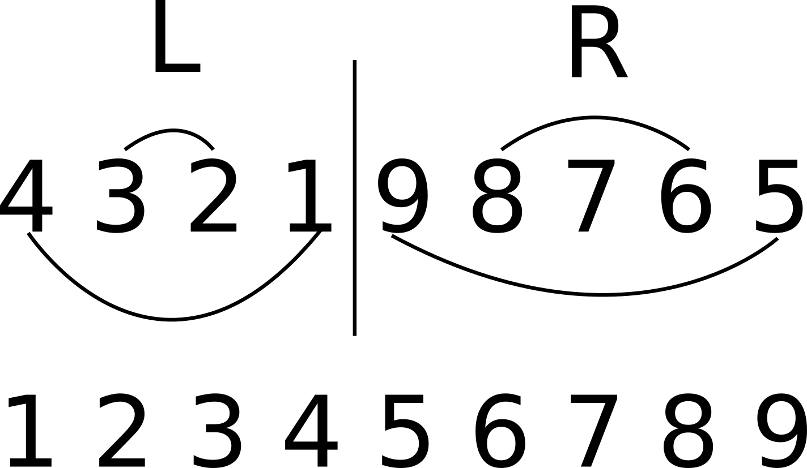

# 9

## Task

```Python
from string import printable


class Shuffler:

    def __init__(self, d):
        self.d = d
        self.c = 0
    
    def do_switch(s, i, j):
        t = s[j]
        s[j] = s[i]
        s[i] = t
        return s

    def get_shuffled(self, deck):
        
        s = list(deck)
        l = (len(s) // 2 - self.d) % len(s)
        r = l + 1

        i = l
        j = 0
        while i > j:
            s = Shuffler.do_switch(s, i, j)
            i -= 1
            j += 1
            self.c += 1

        i = r
        j = len(s) - 1

        while i < j:
            s = Shuffler.do_switch(s, i, j)
            i += 1
            j -= 1
            self.c += 1

        return "".join(s)


class Encoder:

    def __init__(self, c):
        self.c = c
        self.d = {}
        for i in printable:
            self.d[i] = printable[(printable.find(i) + self.c) % len(printable)]

    def encode(self, deck):
        result = list(deck)
        for i in range(len(result)):
            result[i] = self.d[result[i]]
        return "".join(result)


if __name__ == "__main__":

    d = int(input("Enter shuffler initializer >> "))
    shuffler = Shuffler(d)

    s = input("Now gimme some deck >> ")
    deck = shuffler.get_shuffled(s)
    
    encoder = Encoder(shuffler.c)
    print(encoder.encode(deck).encode().hex())
    # 534b44444574384974487173346a436749346a4276764b7849346c4a754236562a
```

## Solution

This task is pretty challenging as it requires some algoritms analysis skills. Although you can bruteforce the solution. So what is happening? There is a class `Shuffler`. The program initializes object of this class with user input. Seems like initializer is the key for `Shuffler`. Later it is used to split the string user inputs into two parts. The magic happens in function `get_shuffled`:

```Python
def get_shuffled(self, deck):
        
        s = list(deck)
        l = (len(s) // 2 - self.d) % len(s)
        r = l + 1

        i = l
        j = 0
        while i > j:
            s = Shuffler.do_switch(s, i, j)
            i -= 1
            j += 1
            self.c += 1

        i = r
        j = len(s) - 1

        while i < j:
            s = Shuffler.do_switch(s, i, j)
            i += 1
            j -= 1
            self.c += 1

        return "".join(s)
```

Here input splits into left part `l` and right part `r`. After that every part is being shuffled by the algorithm shown on the image:


Every time when two elements being swapped program increases value `self.c`. Later this value is passed to `Encoder` class. This class obviously encrypts shuffled array with ROT, using `string.printable` as alphabet. So `shuffler.c` is a second key we don't know. Now we should notice, that performing `do_shuffle` two times, you will get the same array:



This means we don't have to write any code to undo the shuffling. The only code we need is ROT decryptor.

So there are two keys used in the program we don't know. And we have two options:

1) Bruteforce both keys

2) Analyze the code more to determine how much swaps the program performs in `do_shuffle`.

### Option 2
Let's consider second option first. It's pretty easy to notice, that shuffling every part algorithm does two steps over the part. That means there will be less or equals `n/2` swaps, where `n` - length of array. Now we have upper border.

To determine lower border we should notice, that if length of part `p` is an even number, there will be exactly `p/2` swaps in it. Otherwise, there will be `(p - 1) / 2` swaps. So one element won't be used in swap.

Therefore if we split array into two parts of even length we will have `n/2` swaps. If some part has odd number of elements in it, we can substract `1` from array length as one element will not take part in swaps, and there will be `(n - 1) / 2` swaps. Finally if both parts has odd number of elements we get `(n - 2) / 2` swaps. So now we have lower bound. We can now say, that there will be `(n - 2) / 2 ... n / 2` swaps.

But there is one more thing to consider. We can notice that if `n` is an even number the array can be split in two odd parts or two even parts. And never into odd and even part. So for even number of elements in the array there are only two possible values `(n - 2) / 2` and `(n / 2)`. Although if `n` is an odd number, we will always get one odd and one even part, therefore we will always get `(n - 1) / 2` swaps.

Our ciphertext has `33` elements, so no matter how we split the array we always will have `16` swaps. And just like that we have the key for `Encoder`. We still need to bruteforce the key for `Shuffler`.

Code will look like this:

```Python
>>> from shuffler import Shuffler
>>> from string import printable
>>> c = bytes.fromhex("534b44444574384974487173346a436749346a4276764b7849346c4a754236562a").decode()
>>> p = "".join(printable[(printable.find(i) - 16) % len(printable)] for i in c)
>>> p
'Cunnod}sdrac_3m0s_3lffuhs_5tel{FT'
>>> for i in range(len(p)):
...     shuffler = Shuffler(i)
...     t = shuffler.get_shuffled(p)
...     if t.startswith("donnuCTF"):
...             print(t)
...             break
... 
donnuCTF{let5_shuffl3_s0m3_cards}
```

### Option 1
Also without detail analisys of the algorithm we can say there will not be more than `33 * len(printable) = 3300` possible keys. So we can bruteforce all of them in no time:

```Python
>>> c = bytes.fromhex("534b44444574384974487173346a436749346a4276764b7849346c4a754236562a").decode()
>>> for i in range(len(printable)):
...     p = "".join(printable[(printable.find(k) - i) % len(printable)] for k in c)
...     for j in range(len(p)):
...             shuffler = Shuffler(j)
...             t = shuffler.get_shuffled(p)
...             if t.startswith("donnuCTF"):
...                     print(t)
... 
donnuCTF{let5_shuffl3_s0m3_cards}
```
