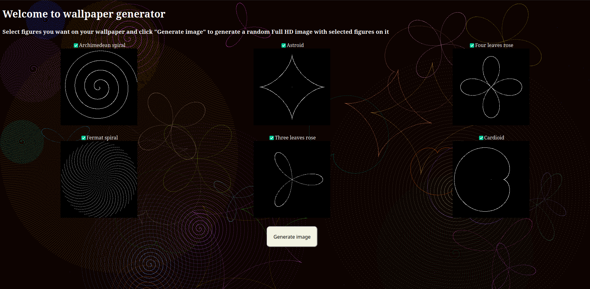
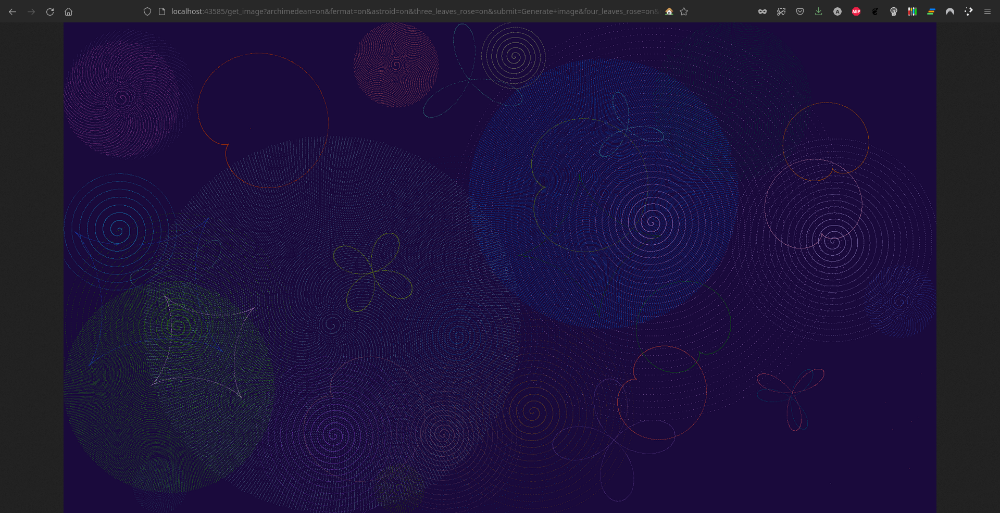
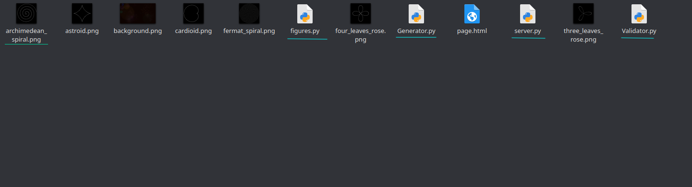
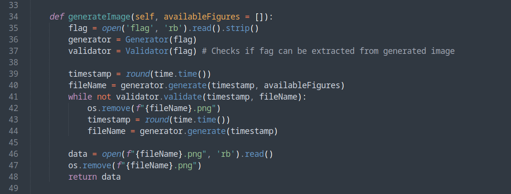
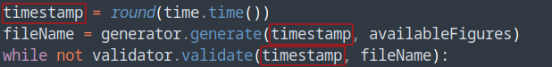

# WallpaperGenerator

## Task

[source.zip](./source.zip)

## Solution

В задании была дана ссылка на веб-сервер. При переходе по ссылке попадаем на сайт



Здесь нам предлагается сгенерировать случайное изображение с различными геометрическими фигурами на нём.
После выбора фигур и нажатия кнопки "Generate image" получаем какое-то случайное изображение. Например:



Никакого особого функционала у нас больше нет. Где тут флаг и как его получить - непонятно.
Надо смотреть исходники.

В архиве у нас есть одна HTML страница, несколько изображений для отображения на этой странице и,
самое главное, 4 файла с исходным кодом:



Нас в первую очередь интересует файл `server.py` (потому что, судя по названию, именно он выполняет роль сервера).

__!NB В файле `figures.py` находится код для рисования фигур на изображении, его рассматривать не будем. Для решения
задания это в принципе не имеет значения.__

В этом файле есть много кода для поддержания работы сервера, который нас не интересует.
Обращаем внимание на функцию `generateImage()`:



__!NB Вообще если непонятно с какой стороны подойти, то нужно искать `flag` или `secret`
и уже оттуда исследовать остальной код__

Что тут происходит:

1) Из файла считывается флаг (с сорцами этого файла, конечно, нет, он есть только на сервере)
2) Инициализируются объекты `Generator` и `Validator`, пока что не смотрим что там происходит.
3) Получаем текущий UNIX timestamp. `time.time()` возвращает число с плавающей точкой, поэтому округляем до инта.
4) Дальше вызывается `generator.generate()`, в которую передаётся таймстемп с массивом `availableFigures` - 
это просто список выбранных пользователем фигур для рисования. Эта функция вернёт нам имя файла. Пока не смотрим в неё.
5) Дальше до тех пор, пока `validator.validate()` возвращает `False` получаем новый таймстемп и генерим новый файл.
__Спойлер: На самом деле `validator.validate()` всегда будет возвращать `True`, а его исходный код можно 
использовать для решения таска.__
6) В конце концов сгенерированный файл считывается в переменную `data`, файл удаляется, а `data` возвращается из функции
и дальше отправляется пользователю.

Флаг, как видим, используется только в генераторе и валидаторе. Значит пора разбираться с их исходниками.

Сначала посмотрим на генератор.

```python
import os
import random
from PIL import Image
from figures import *


class Generator:

	def __init__(self, flag):
		self.flag = flag

	def generate(self, timestamp, availableFigures = []):
		size = (1920, 1080)
		backgroundColor = (random.randint(0, 75), random.randint(0, 75), random.randint(0, 75))
		img = Image.new(size = size, mode = "RGB", color = backgroundColor)

		if len(availableFigures) == 0:
			fileName = os.urandom(8).hex()
			img.save(f"{fileName}.png")
			return fileName

		colors = []
		figures = []
		for i in self.flag:
			k = random.randint(50, 100) * 0.03
			figure = random.choice(availableFigures)
			if figure != ArchimedeanSpiral or figure != FermatSpiral:
				figures.append(figure(k, angle = random.randint(0, 360)))
			else:
				figures.append(random.choice(availableFigures)(k))
			red = random.randint(1, 175) % 175
			green = i
			blue = random.randint(1, 175) % 175
			colors.append((red, green, blue))

		centers = []
		random.seed(timestamp)
		for i in self.flag:
			x = random.randint(50, size[0] - 50)
			y = random.randint(50, size[1] - 50)
			while (x, y) in centers:
				x = random.randint(50, size[0] - 50)
				y = random.randint(50, size[1] - 50)
			centers.append((x, y))


		for i in range(len(self.flag)):
			s = figures[i]
			s.draw(
				img,
				center = Dot(centers[i][0], centers[i][1]), 
				color = Color(colors[i][0], colors[i][1], colors[i][2]), 
				ignore = centers
			)

		fileName = os.urandom(8).hex()
		img.save(f"{fileName}.png")
		return fileName
```

Здесь сначала создаётся изображение размером `1920x1080` с каким-то случайным фоном. Дальше идут три интересных цикла,
которые, очевидно, как-то зависят от флага.

Смотрим на первый:

```python
colors = []
figures = []
for i in self.flag:
	k = random.randint(50, 100) * 0.03
	figure = random.choice(availableFigures)
	if figure != ArchimedeanSpiral or figure != FermatSpiral:
		figures.append(figure(k, angle = random.randint(0, 360)))
	else:
		figures.append(random.choice(availableFigures)(k))
	red = random.randint(1, 175) % 175
	green = i
	blue = random.randint(1, 175) % 175
	colors.append((red, green, blue))
```

Цикл проходит по символам флага. Здесь `i` - один символ. Т.к. флаг из файла считывался как байты, это будет не строка,
а число (0 - 255).

В первой половине цикла не используется значение `i` (не забываем что это символ флага и только это нам важно).
Пропускаем эту часть и смотрим сразу на 4 последних строки. Здесь создаются 3 переменных `red`, `green` и `blue`.
`red` и `blue` генерируются случайным образом. А вот в `green` записывается символ флага. Потом эти значения добавляются
в массив `colors`. Итог первого цикла: имеем 2 массива - `figures` и `colors`. В `figures` у нас находятся случайные
фигуры, а в `colors` хранятся `RGB` кортежи, причём `G` значения равны символам флага.

Теперь смотрим на второй цикл:

```python
centers = []
random.seed(timestamp)
for i in self.flag:
	x = random.randint(50, size[0] - 50)
	y = random.randint(50, size[1] - 50)
	while (x, y) in centers:
		x = random.randint(50, size[0] - 50)
		y = random.randint(50, size[1] - 50)
	centers.append((x, y))
```

Важно не пропустить строчку `random.seed(timestamp)`. Здесь ГПСЧ инициализируется тем таймстемпом, который был получен
в начале функции `generateImage()`. Это важно для решения таска и скоро мы увидим как именно.

В цикле у нас случайным образом генерируется пара значений `(x, y)`. Эта пара генерируется снова и снова пока не 
сгенерируется такая пара значений, которой нет в массиве `centers` (изначально пустой). Потом эта пара добавляется в массив. __Rem: пары `(x1, y1)` и 
`(x2, y2)` равны только если `x1 = x2` и `y1 = y2`. Пары `(3, 2)` и `(3, 2)` равны, а пары `(3, 2)` и `(2, 3)` - нет.__

Этот цикл тоже проходит по флагу, хотя значение `i` нигде и не используется. Итог исполнения второго цикла: массив 
`centers`, который содержит различные пары чисел. В каждой итерации цикла добавляется одна пара. Таким образом, у нас
теперь есть 3 массива, все равны по длине (длина каждого равна длине флага).

Третий цикл в конце концов использует эти три массива для отрисовки фигур:

```python
for i in range(len(self.flag)):
		s = figures[i]
		s.draw(
			img,
			center = Dot(centers[i][0], centers[i][1]), 
			color = Color(colors[i][0], colors[i][1], colors[i][2]), 
			ignore = centers
		)
```

Этот массив пробегает по значениям `i = 0, 1, 2, ... flag.length`. Для каждого `i` берёт фигуру из массива `figures` и 
рисует её цветом из массива `colors`. Центр фигуры находится в точке из массива `centers`.

__Таким образом, каждая фигура на картинке соответствует символу флага и в зелёном канале цвета этой фигуры находится 
сам этот символ.__

Как теперь вытащить флаг? Вся проблема в том, что мы не знаем какая фигура какому символу соответствует, потому что
фигуры располагаются на картинке случайным образом. Вот если бы могли восстановить последовательность случайных чисел,
которые генерируются во втором цикле. Тогда бы мы смогли найти центры фигур для каждой позиции флага. И глядя на центр
цвет пикселя в центре фигуры мы смогли бы определить символ флага. Тут-то строчка `random.seed(timestamp)` и приобретает
смысл. Зная `timestamp`, можно восстановить случайную последовательность генератора. Именно это свойство и используется
в классе `Validator`:

```python
class Validator:

	def __init__(self, flag):
		self.flag = flag

	def validate(self, timestamp, fileName):
		img = Image.open(f'{fileName}.png')
		pixels = img.load()

		centers = []
		random.seed(timestamp)
		for _ in range(len(self.flag)):
			x = random.randint(50, img.width - 50)
			y = random.randint(50, img.height - 50)
			while (x, y) in centers:
				x = random.randint(50, img.width - 50)
				y = random.randint(50, img.height - 50)
			centers.append((x, y))

		flag = ""
		for i in range(len(self.flag)):
			p = pixels[centers[i][0], centers[i][1]]
			flag += chr(p[1])

		return flag.encode() == self.flag
```

Первый цикл в функции `validate()` в точности повторяет второй цикл в функции `Generator.generate()`. А дальше есть
второй цикл, который проходит по центрам фигур и собирает символы флага. В конце концов функция возвращает `True`, если
собранные символы равны символам флага. А они, конечно, равны, потому что ГПСЧ у нас детерминированный, а `generate()` и `validate()` используют
одинаковое значение `timestamp`:



Надеюсь, что теперь понятно как извлечь флаг из сгенерированной картинки зная `timestamp`. Фактически здесь можно просто скопировать
функцию `validate` и вместо `return flag.encode() == self.flag` написать `print(flag)`. Но есть ещё одна проблема - `timestamp`-то мы как раз и 
не знаем. 

Тут вспоминаем, что `timestamp` - это UNIX timestamp, т.е. кол-во секунд с начала эпохи. Но ведь от момента получения таймстемпа и скачивания нами 
картинки себе на компьютер прошло не так уж много секунд, правда? То есть скачав картинку мы можем получить текущий таймстемп на локальной машине и просто
перебрать предыдущие таймстемпы пока не найдём тот, который позволит нам правильно вытащить флаг. Код декодера фактически
соответствует коду функции `Validator.validate()`, только нужно добавить цикл и пару строк для проверки того, что мы вытащили правильный флаг:

```python
import time
import random
from PIL import Image


img = Image.open('get_image.png')
pixels = img.load()


timestamp = round(time.time())
while True:
	centers = []
	random.seed(timestamp)
	for _ in range(42):
		x = random.randint(50, img.width - 50)
		y = random.randint(50, img.height - 50)
		while (x, y) in centers:
			x = random.randint(50, img.width - 50)
			y = random.randint(50, img.height - 50)
		centers.append((x, y))

	flag = ""
	for i in range(42):
		p = pixels[centers[i][0], centers[i][1]]
		flag += chr(p[1])

    # Если флаг начинается на "donnu" то мы нашли правильный timestamp и можно остановить цикл
	if flag[:5] == "donnu":
		print(flag)
		break
    # Иначе, уменьшаем таймстемп (т.е. возвращаемся на 1 секунду назад) и пробуем снова.
	timestamp -= 1
```

```bash
awawa@awawa-pc:~$ python3 decoder.py 
donnuCTF{830c704cc9bb6f98b28757e659309ec1}
```